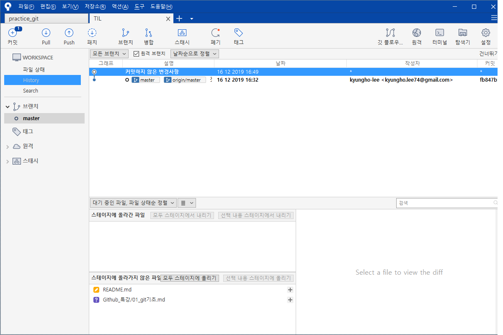

# Git 기초

## 개념

### SCM 이란?

- source code manage 의 약자로, 코드의 버전을 관리하기 위해 존재한다.
  1. 버전관리의 필요
  2. 버전이 늘어나도 내용요약을 알 수 없다.
  3. 메시지기능을 포함
  4. 원격으로 백업해서 복구가 쉽게 가능
  5. 사용하기 편리하게 GUI제공

### Git

- git은 Linus Torvalds 가 만든 SCM으로, 현재 가장 많이 사용된다.
- Local 저장소에 CCtv를 설치해서 스냅샷을 찍는 방식
- 찍은 스냅샷을 이전 스냅샷과 비교해 수정된 부분만 확인후 변경한다.

### Github

- github는 git을 원격으로 크라우드 방식으로 저장소를 생성하고 파일및 공동작업이 편리하게 해주는 플렛폼

  

## Git & Github 작업순서

1. 소스트리에 Repo를 연결 한다.
2. 변경된 사항을 스테이지에 올린다.
3. 메세지 작성후 커밋
4. Git hub remote repo 생성
5. 생성된 Url을 연결하고 인증
6. remote origin 에 Push

## 관련Tool

### source tree

- 소스관리 툴

### Typora

- [Typora](https://www.typora.io/) : Mark down 사용 문서작성 툴 README.md 작성

### Gitignore.io

- [gitignore.io](http://gitignore.io/) : 프로젝트 repo생성시 gitignore를 쉽게 만들어주는 사이트

