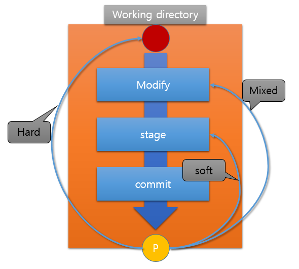

# Git 중급

# 학습목표

git을 이용해서 협업시 발생하는 comflict를 해결하고 branch관리를 할 수 있다.

## Summary

### 1. clone

### 2. Remote

### 3. branch

### 4. Comflict

### 5. Reset 

### 6. Pull Request

__________

## 1. clone

Remote 혹은 현재 로컬에 있는 프로젝트를 git설정을 포함해서 히스토리를 모두 가져올때 작업

- 순서

  1. 자신의 소스트리에서 Newtab 선택
  2. Clone 버튼을 선택후 Repository 위치혹은 URL입력
  3. 저장할 위치 선택 (미리 git init.하지 않은 폴더생성)
  4. 클론완료 : 클론이 정상적으로 되면 최초동기화는 완료된것임.

- 주의사항

  github에서 download를 이용해서 프로젝트를 설정할때는 git히스토리는 없음, 단순 백업용도로 사용함.

## 2. Remote

원격 Repository와 연결하여 동기화 하는 작업

- 순서

  1. Local에서 `git Init.`을 한다. (Git Init.은 .gitignore와 README.md를 생성하는것)
  2. Github에 프로젝트를 생성후 clone 링크를 생성
  3. Local 소스트리에 클론을 이용해 연결
  4. 로컬에 있는 자료를 Push해서 원격저장소에 업로드한다.

- 주의사항

  Remote상태에서는 **Pull**은 상시 수행하고 습관적으로 수행하는 것이 좋다. 하지만 최종 **PUSH**단계에서는 최종제출의 개념으로 접근한다.

### git으로 장소에 상관없이 동시작업

- 회사에서 작업한 파일을 집에서 이어서 작업

  1. A장소에서 리모트와 연결
  2. 리모트로 Push
  3. 집에서 리모트로 부터 Clone (zip다운로드시 git정보없음)
  4. 최초 clone시는 Pull동기화작업까지 자동완료
- 집에서 작업후 동기화

  1. 집에 도착후 Pull 해서 동기화
2. 집에서 작업후 스냅샷(커밋) 메시지 작성
  3. 작업된 부분을 Push

### collaboration

- 공동작업시 순서

  - A 프로젝트 생성자
    1. 프로젝트생성 후 VSC로 Git init.을 한다. (폴더 GIt init - .gitignore/README.md 생성)
    2. 소스트리에서 프로젝트 생성 (creat a repository/경로) 에러무시
    3. Remote 생성 (Github 프로젝트 생성) 후 원격연결
    4. Remote에서 collaborators 에서 초대 (이메일인증)

  - B collabo 작업자
    1. B는 콜라보레이션 작업자
    2. 이메일에서 Invite를 수락한다.
    3. 소스트리에서 프로젝트 clone
    4. 필요한 부분 작업 후 push
    5. 다른 파일 충돌시 Pull후 push한다.

## 3. branch

**Master == 배포가능한 상태**

​	Master branch는 서비스 가능한 상태를 유지해야한다.  Master에서 브랜치에 있는 것을 가져오는 방식

> 마스터는 항상 꽃길만 가야한다.

- 순서

  1. Branch 생성 - 가지치기 : aaa/aaa 뎁스를 만든다.
  2. check out : 앞에 O표시와 Bold로 표시되는 곳이 내가 위치한 타임라인
  3. 소스트리에서 explorer를 선택한 후 해당폴더에서 오른쪽클릭 open the code를 선택해서 VSC를 활성화한다.
  4. 코드 혹은 문서를 수정후 저장
  5. Add → commit 
  6. 브랜치에서 작업이 끝난 후 브랜치상태로 푸시한다.(계속수정시)
  7. 작업이 완료되면 master로 체크아웃후 Merge를 한다.
  8. 작업완료된 branch는 제거한다. remote/본인이 생성한 branch 정기적으로 삭제해야한다.

  ----

  ※ 실제 실무에서 Master를 직접작업하는 경우는 거의 없음 항상 브랜치를 생성해서 작업후 Pull을 통해서 최신상태로 유지하고 work day에 일과를 마무리할때 Push를 하는것을 몸에 익혀야 한다. Push도 자주하는것이 아니라 최종 제출시 최소횟수로 진행한다.  

## 4. Comflict

### 충돌

Remote로 접속할때 스냅샷의 싱크가 맞지 않은 상태

항상 `Remote Repository`와 싱크를 맞추기위해 Pull을 한뒤에 작업하는 습관을 가진다.

### case1 (commit)

1. `remote Pull` 받기전에 `Commit`할 내용이 있으면 에러
2. `commit`을 완료후 `Pull`을 받은 후 작업하면 해결

### case2 (Pull)

1. Pull할때 동일한 파일이 서로 충돌이 난 경우
2. 각 작업파일별로 `VSC`를 사용해서 수정된 내용을 찾아서 변경해서 해결한다.

### 5. Reset

작업중 되돌리기를 할때 사용하는 프로세스로 복구하는 위치에 따라 soft/mixed/hard로 나뉜다.

- soft reset : commit 이전 stage에 올라간상태
- mixted reset : stage에 add하기 전 상태
- hard reset : 스냅샷찍기 이전상태

## 6. Pull Request

- 작업한 파일을 remote로 자신의 `fork/repo.`에 `push`를 한 다음 `pull request`를 요청한다. 
- code review 나 리퀘스트 수락하고 contributors로 등록이 되면 work flow에 참여가 가능하다.
- 실제 오픈소스 프로젝트에서 다양한 기여자들이 있으며 글로벌기업에서는 중요한 경력사항으로 인정해주고 있다.