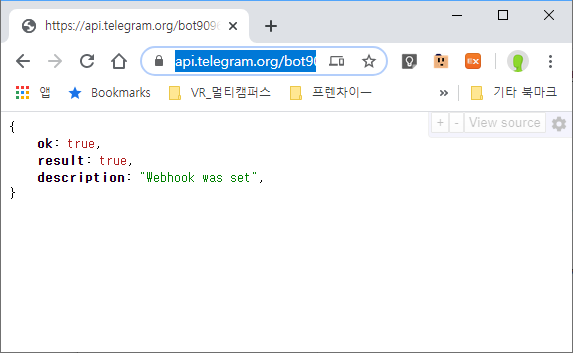

## 알고리즘 기초

프로그래밍으로 하고 싶은것을 먼저 글로 작성한다.

저장/ 반복/ 분기

# 크리스마스 트리만들기

1. 나무, 전구, 장식을 준비한다.

2. 나무가 충분히 예쁠때 까지 장식한다.
   - 나무가 예쁜가?  (- 분기)
   - 예쁠때 까지 장식을 반복한다. (- 반복)
   - 나무를 장식한다는 것은 나무 = 나무 + 장식 (- 저장)
3. 나무가 충분히 예쁘면 그 나무는 크리스마스 트리가 된다.
   - 나무가 예쁘면 = 분기
   - 크리스마스트리 = 나무 (- 저장)

## code

```python
# while 문 과 변수
tree = '나무'
# len(tree) == 2
bulb = '전구'
deco = '장식'

while len(tree) > 20:
    tree = tree + bulb + deco
    # 1st '나무전구장식'
    # 2nd '나무전구장식전구장식'
    
christmas_tree = tree
print(christmas_tree)

# for문
# print()함수를 통해
# 인사를 열번하는 코드를 작성해주세요.

hi = '안녕하세요!'
#print (hi)

for i in range(0,10):
    # 0~9까지 반복을 실행합니ㅏㄷ.
    print (hi)
    
   
#import 를 사용해 python함수를 로드한다.
#오늘의 점심메뉴를 추천해주는 프로그램
# import 는 사용할 함수를 가져온다.
# dictionary {}를 사용한다. 확장정보관리
import random

menu = ['새마을식당','초원삼겹살','멀캠20층','홍콩반점','순남시래기']
phone_book = {
    '새마을식당':'010-1234-1213',
    '초원삼겹살':'02-22-22222',
    '멀캠20층': '031-111-111',
    '홍콩반점':'033-444-4444',
    '순남시래기':'02-333-3333'
}
# print(phone_book['새마을식당'])
# menu의 요소 중 랜덤으로 골라서 lunch라는 변수에 담아주세요.
lunch = random.choice(menu)
print(lunch, phone_book[lunch])

----

# 로또 번호 랜덤 추출기
import random

numbers = range(1,46)
# 이것의 결과는 배열 [1,2,3,...,45] 과 비슷
# random.choice 를 사용해 6개의 번호를 뽑아 출력하세요 - choice는 중복허용
# random.sample 은 중복제거
lotto = random.sample(numbers,6)
print(sorted(lotto))
# sorted 함수는 자동정렬
# 단축키 : alt + shift + 위 or 아래 방향키 이전라인 복사
# 단축키 : alt + 위 or 아래 라인 이동

#명단에서 이름을 뽑아서 영어소개와 한글소개
import random

name = ['홍길동','희동이','둘리']
eng_name = {
    '홍길동':'Hong',
    '희동이':'dong',
    '둘리':'twolee'
}

지목된사람 = random.choice(name)
지목된영어이름 = eng_name[지목된사람]

#저는 홍길동 입니다. My name is hong을 만들고 싶다.
intro = '저는 '+ 지목된사람 +'입니다.'+ ' My name is '+지목된영어이름
intro2 = '저는 {}입니다. My name is {}'.format(지목된사람,지목된영어이름)
intro3 = f'저는 {지목된사람}입니다. My name is {지목된영어이름}'

print(intro)
print(intro2)
print(intro3)
----

# 네이버에 있는 증시 페이지에 대신 접속을 해서 ,
# 현재 코스피 지수를 가져오는 프로그램
# bash에서 pip requests 를 치면 requests 모듈을 다운받고 설치한다.
import random
import requests
import bs4

# 이 주소로 요청을 보내면 응답으로 HTML파일이 도착함.
html = requests.get("https://finance.naver.com/sise/sise_index.nhn?code=KOSPI")

# html.text 를 내가 보기 좋게 접근할 수 있게 변경.
soup = bs4.BeautifulSoup(html.text,'html.parser')
# css selector로 내가 원하는 태그를 가져오겠다.
kospi = soup.select_one('#now_value')

print(kospi.text)


#오류상황 issue : 파일중 string.py라는 파일이 있어서 requests에서 해당 파일을 인식해서 발생 파일명수정
#now_value
---------------
import bs4
import requests
# https://finance.naver.com/marketindex/ 이 주소를 통해
# 환율이 얼마인지 가져오는 프로그램을 작성해주세요!

html = requests.get('https://finance.naver.com/marketindex/')
# html에 url주소의 Html파일정보를 가져온다.
# html.txt를 내가 보기 좋고 접근하기 좋게 변경
soup = bs4.BeautifulSoup(html.text,'html.parser')
dollar = soup.select_one('#exchangeList > li.on > a.head.usd > div > span.value')

print (dollar.text)
#exchangeList > li.on > a.head.usd > div > span.value

----------
import requests
import bs4

html = requests.get('https://www.naver.com')
soup = bs4.BeautifulSoup(html.text,'html.parser') # 규칙 

keywords = soup.select('span.ah_k') # 값이 여러개 일때 배열로 저장됨, 

#keywords = ['a','b','c']
# for keywords in keywords:
#     print(keywords.text)

# 배열[0:n]  → 배열의 0번째 인덱스 부터 n-1번째
# 인덱스들의 요소를 가져와서 배열로 만든다.

real_keywords = keywords[0:20]  # keywords 배열에서 0~20까지만 저장

# real_keywords에 있는 배열요소에 keyword라고 인덱스를 붙이고 keyword에 있는
# 문자만 real_real_keywords에 배열로 저장
real_real_keywords = [keyword.text for keyword in real_keywords] 

# 무엇이 1등인지 모르게 가나다 순으로 정렬해버리기
problem = sorted(real_real_keywords)
print('아래의 보기 중에서 1위를 고르세요')
print(problem)

# 사용자 입력받기
answer = input('당신이 생각한 실시간 검색어 1위는? : ')
# 사용자 입력 예외처리 공백없애기
answer = str.replace(answer,' ','')
# 배열[0] : 배열의 첫번째 요소
# == 양쪽 변수에 값이 같은지 확인  : 배열첫번째 값과 비교
if answer == real_real_keywords[0] :   
    print(f'당신이 입력한 답 :{answer} ')
    print('정답입니다.')
else:
    print(f'당신이 입력한 답 :{answer} ')
    print('오답입니다.')


# [0,1,2,3,4,5............,100]
# numbers = [i for i in range(0,101)]  #numbers 라는 
# print(numbers)

# numbers = []
# for i in range(0,101):
#     numbers.append(i)
# print(numbers)

# selenium을 이용한 web browser 크롤링

from selenium import webdriver
from selenium.webdriver.common.keys import Keys  #마지막 K는 capital letter
# import bs4
# soup = bs4.BeautifulSoup()
# from bs4 import BeautifulSoup
# soup = BeautifulSoup()

path ='./chromedriver.exe'  # 현재위치에서 해당 드라이버를 가져오겠다.
driver = webdriver.Chrome(path)
driver.get('https://www.google.com/')

search_input = driver.find_element_by_css_selector('#tsf > div:nth-child(2) > div.A8SBwf > div.RNNXgb > div > div.a4bIc > input')
search_input.send_keys('코리아보드게임')
search_input.send_keys(Keys.RETURN) # 입력후 검색어작동

# #tsf > div:nth-child(2) > div.A8SBwf > div.RNNXgb > div > div.a4bIc > input :구글입력창 위치

```

----


# Telegram chat bot

## 준비

1. project Init (폴더생성/소스트리/리모드Repo/.gitignore)
2. Telegram web 가입
3. app.py 파일생성
4. Telegram bot생성
   1. BotFather /start/newbot
   2. botname(unique)_bot : 생성완료시 
   3. get Token HTTP API : 카피
5. 브라우저 https://api.telegram.org/bot<token>/getMe 접속해서 링크확인
6. setwebhook을 통해서 챗봇과 로컬 호스트 연결


## code


SetWebhook : 



# NGROK 세팅

로컬서비스를 호스팅 포스트를 생성

※ 재시작시 주소가 변경되므로 끄지않고 사용하며 꺼졌을때는 새로 생성된 주소를 https://api.telegram.org/bot909658793:AAEm9LgZxV63kZN5FSC2BcCEmQ9752cDZ8k/setwebhook?url=**<https://0ff6c5c5.ngrok.io>**'/chatbot 확인

## 준비

1. ngrok 다운로드

2. 압축풀기 (exe파일실행)

   1. cmd -> ngrok http 5000 (port)

   2. >

# 파파고 번역API 탑재하기

## 준비

1. 네이버 Develop 센터에 로그인 /인증/
2. 파파고 API
   1. client id, client secret 발급
3. .env 에 등록후 사용
4. url ="https://openapi.naver.com/v1/papago/n2mt"

## code


# Pythonanywhere 등록

## 준비

1. 가입
2. web 선택
3. add a new web app
   1. Flask
   2. python 3.8
4. 주소생성
5. 코드입력 (filesa->mysite->flask_app.py)
6. 모듈설치 (consoles->bash-> pip3 install python-decouple --user) - .env를 사용하기 위한 모듈

```python

```

